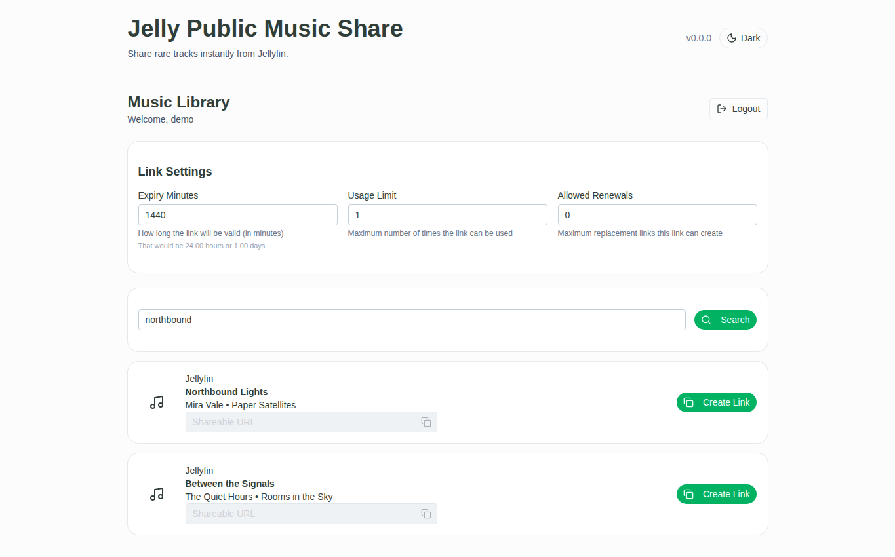
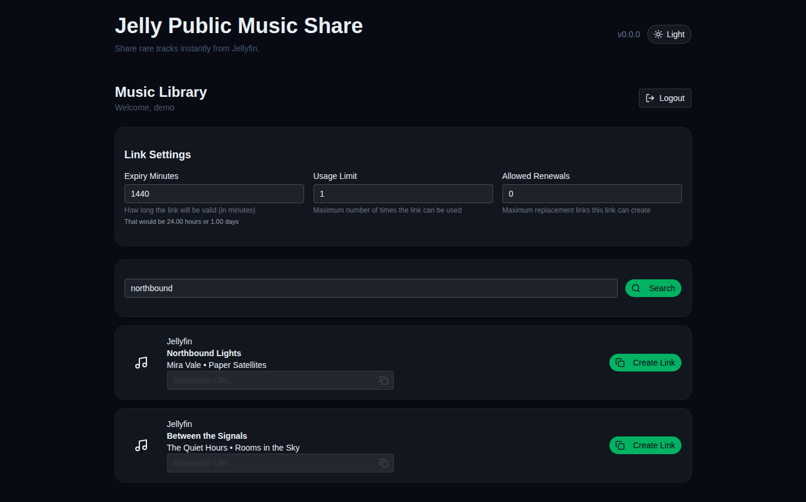
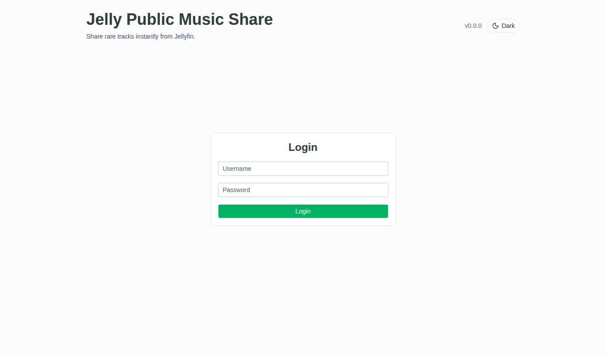
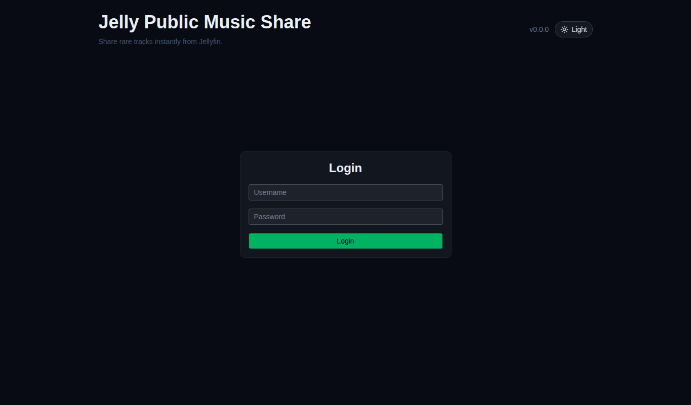
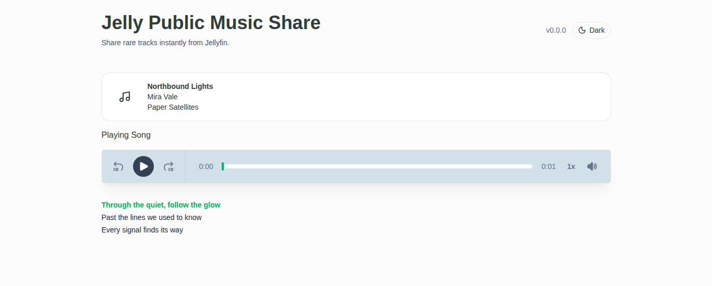
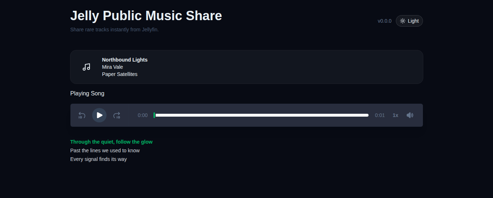

# Jelly Public Music Share

Share tracks from a self-hosted Jellyfin or Navidrome library without creating accounts for listeners. Search your library, create a link with configurable expiry and usage limits, and send it to the person who wants to listen.

Links open a focused playback page and do not give listeners access to your music library. Link expiry, usage limits, and allowed renewals can be set when creating a link.

## Screenshots

| Page | Light mode | Dark mode |
| --- | --- | --- |
| Library |  |  |
| Sign in |  |  |
| Shared playback |  |  |

These screenshots use fictional sample data and mocked API responses.

## Features

- Search configured Jellyfin and/or Navidrome libraries.
- Create share links with configurable expiry, usage limits, and renewals.
- Stream shared tracks on a separate playback page.
- Optional lyrics and track metadata on the playback page.
- Protect library search and link creation behind owner authentication.
- Store token and request data in SQLite.
- Deploy with Docker Compose or the prebuilt image from GitHub Container Registry.

## Quick Start: Docker Compose

1. Clone the repository and enter its directory:

	```bash
	git clone https://github.com/BelphegorPrime/jelly-public-music-share.git
	cd jelly-public-music-share
	```

2. Create and edit the environment file:

	```bash
	cp .env.example .env
	```

	Configure **one or both** media providers in `.env`. Jellyfin requires `JELLYFIN_URL`, `JELLYFIN_USERNAME`, and `JELLYFIN_API_KEY`; Navidrome requires `NAVIDROME_URL`, `NAVIDROME_USERNAME`, and `NAVIDROME_PASSWORD`. Set a strong `AUTH_PASSWORD` and replace both JWT secrets with unique random values. For example, run `openssl rand -hex 32` twice and use the outputs for `JWT_SECRET_OWNER` and `JWT_SECRET_CONSUMER`.

	When running in Docker Compose, use a media-server address reachable from the container. `localhost` inside the container refers to the container itself; on Docker Desktop, `host.docker.internal` can reach services on the host.

3. Build and start the app:

	```bash
	docker compose up -d --build
	```

4. Open [http://localhost:3000](http://localhost:3000) and sign in with the `AUTH_USERNAME` and `AUTH_PASSWORD` from `.env` (the example username is `admin`).

Compose persists application data in `./data`. To inspect logs or stop the app:

```bash
docker compose logs -f
docker compose down
```

### Run the prebuilt image

For a standalone Docker deployment, after creating and configuring `.env` as above:

```bash
docker run -d \
  --name jelly-public-music-share \
  --env-file .env \
  -p 3000:3000 \
  -v "$PWD/data:/data" \
  --restart unless-stopped \
  ghcr.io/belphegoprime/jelly-public-music-share:latest
```

## Configuration

At least one media provider must be configured. Use the service URL and credentials appropriate for your deployment:

| Variable | Purpose |
| --- | --- |
| `JELLYFIN_URL` | Jellyfin server URL, for example `http://jellyfin:8096` |
| `JELLYFIN_USERNAME` | Jellyfin account used by the app |
| `JELLYFIN_API_KEY` | Jellyfin API key |
| `NAVIDROME_URL` | Navidrome server URL, for example `http://navidrome:4533` |
| `NAVIDROME_USERNAME` | Navidrome account used by the app |
| `NAVIDROME_PASSWORD` | Navidrome account password |
| `AUTH_USERNAME` / `AUTH_PASSWORD` | Credentials for the app owner login |
| `JWT_SECRET_OWNER` | Secret used to sign owner authentication tokens |
| `JWT_SECRET_CONSUMER` | Secret used to sign shared-song tokens |
| `BASE_URL` | Public app URL used when generating share links; set this behind a reverse proxy |
| `TOKEN_EXPIRY_MINUTES` | Default link expiry in minutes (default: `1440`) |
| `TOKEN_USAGE_LIMIT` | Default number of permitted link uses (default: `1`) |
| `TOKEN_ALLOWED_RENEWAL_COUNT` | Default number of replacement links allowed (default: `0`) |
| `DATA_DIR` | Application data directory (default: `/data` in Docker) |

The owner can adjust expiry, usage limits, and renewals in the library screen. Keep `.env` private and do not expose the app directly to the internet without HTTPS and an appropriate reverse proxy.

## Development

**Requirements:** Node.js 24 or later, npm, and FFmpeg. SQLite is managed by the application.

Install the backend and frontend dependencies, and configure the provider and authentication variables in `.env`:

```bash
npm install
npm install --prefix client
```

### Screenshots

Install Playwright's Chromium browser once:

```bash
npx playwright install chromium
```

After UI changes, regenerate screenshots for `/`, `/login`, and `/play/demo-token` in both themes:

```bash
npm run screenshots
```

The command starts the frontend, uses mocked API responses, and writes the screenshots to `docs/screenshots/`. Pass route paths or `--theme` to capture only selected pages or themes:

```bash
npm run screenshots -- /login /play/demo-token --theme dark
```

Build both parts of the app and start the server:

```bash
npm run build
npm run build --prefix client
npm start
```

The app is served at [http://localhost:3000](http://localhost:3000). For frontend development, run `npm run dev:server` from the repository root and `npm run dev` from `client/` in separate terminals; Vite serves the client at [http://localhost:5173](http://localhost:5173) and proxies API requests to the backend.

## License

[MIT](LICENSE)
